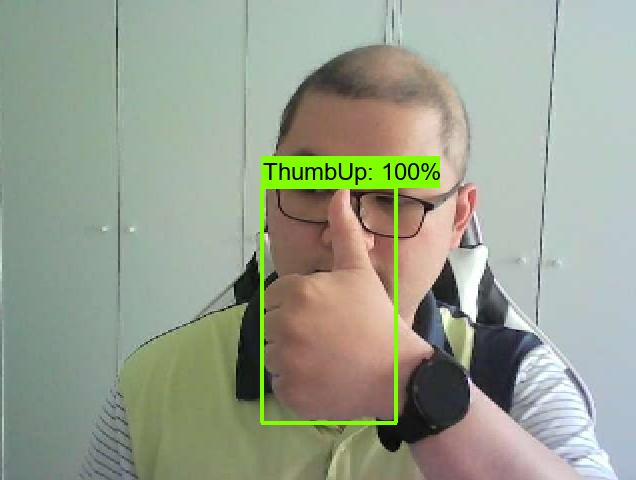
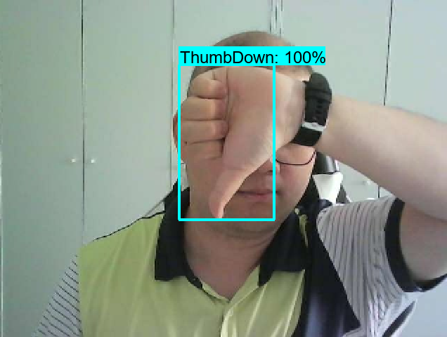
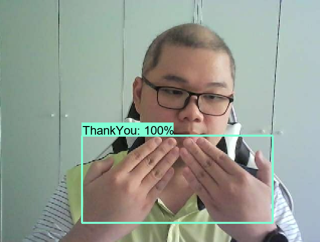
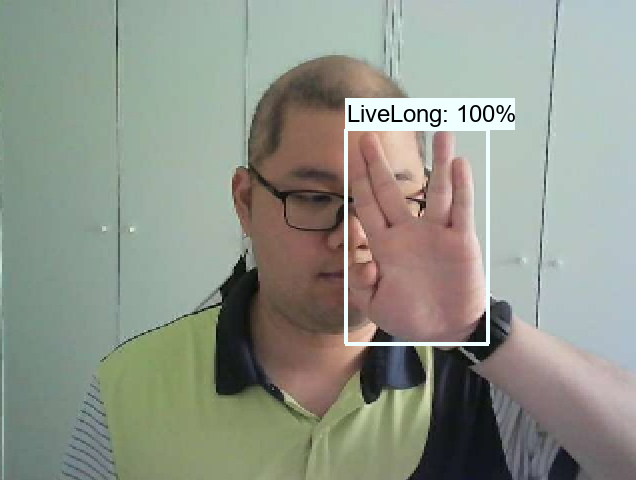

# Object Detection Project


## Contents
1. [Introduction](#Introduction)
2. [Relevant Repositories](#relevant-repositories)
3. [Installation Instructions](#installation-instructions)
4. [Usage Instructions](#usage-instructions)
5. [Acknowledgement](#acknowledgement)

## Introduction

This repo contains the code for Object Detection task. By default, this model will recognize 4 categories:
<p align="center">
    
    
    
    
</p>
After recognizing the region of interest, this model will mark it with a retangle box and show probability score, 
as well. Moreover, it can detect up to five Hand Signs in one single frame and show them up.


## Relevant Repositories

- Tutorial: [TFOD Course from nicknochnack](https://github.com/nicknochnack/TFODCourse)
- Image annotation: [labelImg](https://github.com/HumanSignal/labelImg)
- TF Record Generator: [Generator from nicknochnack](https://github.com/nicknochnack/GenerateTFRecord)
- Models: [TensorFlow Model Garden](https://github.com/tensorflow/models/tree/master)
- Utilized model: [TensorFlow model Zoo tf2 - SSD MobileNet V2 FPNLite 320x320](https://github.com/tensorflow/models/blob/master/research/object_detection/g3doc/tf2_detection_zoo.md)


## Installation Instructions

- I used:
  - Windows 10
  - Python v3.10.3
  - Protobuf v3.8.0
  - CUDA v12.3 and Cudnn v8.9
  - TensorFlow v2.10.1
- I trained the model on an NVIDIA GeForce GTX 1660 with 6GB of memory.

### Install and activate virtual environment
First go to a directory, where you want to save your project. Then open terminal. Here I named my virtual environment 
"venv_od". You can change this name as the one you want.
```python
python -m venv venv_od
.\venv_od\Scripts\activate
python -m pip install --upgrade pip
```

### Install requirements for Dataset Collection
```python
pip install opencv-python
```

### Install requirements for Dataset Annotation 
```python
git clone https://github.com/HumanSignal/labelImg.git
pip install --upgrade pyqt5 lxml
pyrcc5 -o .\labelImg\libs\resources.py resources.qrc
```

### Install requirements for Object Detection
#### Step 1: Download, extrack and add protoc (bin) to Environment Variable
Follow the instruction 
[here](https://github.com/protocolbuffers/protobuf/releases/tag/v3.8.0)

#### Step 2: Clone Tensorflow Object Detection
```python
git clone https://github.com/tensorflow/models.git
```

#### Step 3: Install Tensorflow Object Detection API
NOTICE: Install in terminal, NOT in IDE
```python
cd .\models\research
protoc object_detection\protos\*.proto --python_out=.
cp object_detection\packages\tf2\setup.py .
pip install .
python setup.py build
python setup.py install
cd .\slim
pip install -e .
```

#### Step 4: Install CUDA and Cudnn

- Follow instructions in these two links from tensorflow:
  - https://www.tensorflow.org/install/source
  - https://www.tensorflow.org/install/pip
- During Verification of CUDA and Cudnn, these command might be helpful:
```python
pip install --upgrade --force-reinstall zstandard
python -c "import zstandard as zstd; print(zstd.__version__)"
```

#### Step 5: Download model

- Here, I used TensorFlow model Zoo tf2 - SSD MobileNet V2 FPNLite 320x320, which can be found and downloaded 
[here](https://github.com/tensorflow/models/blob/master/research/object_detection/g3doc/tf2_detection_zoo.md)
- You can create a new directory in the root folder by using these commands
```python
cd ..\..\..\
mkdir pretrained_model
```
- You download the model you want in this new folder, extract it there

#### Step 6: Create some useful folders
```python
mkdir custom_model
cd custom_model
mkdir train
mkdir eval 
cd ..
```

## Usage Instructions

### DATASET

The "collect_dataset.py" script does two tasks:

- Capturing new dataset for four classes: ThumbUp, ThumbDown, ThankYou, LiveLong. Each class has 10 images.
- Split dataset AND THEIR CORRESPONDING DETECTION BOXES into train and test set with ratio 80:20

This script has one argument: 

- **type**: It asks, whether you want to capture new dataset or split existing dataset. It has two values: "capture", 
and "split". By default, it is set to "capture"

#### Capture new dataset
```python
cd ..\..\..\
python collect_dataset.py
```

Then, a webcam window will appear for you to test your position. If you are comfortable with your position, just type
"q" to close the window. Right after that, the capturing process will start. You just need to follow the instruction 
showed in console window. For each image, you have around two seconds to make a pose after the instruction appearing 
in the console window. Try not to move during capturing to have a sharp image.

#### Image annotation
```python
python .\labelImg\labelImg.py
```

A window will appear, you just follow the instruction in [this](https://github.com/HumanSignal/labelImg) repo. 

In summary, the annotation process will be as followed:

- Choose the directory for each class with "Open Dir".
- Use "w" key on keyboard to create a rectangle box. Grab the ROI to mark it.
- A window will appear for you to type in the class name. You have to write the name the same as the one you use in the 
script, case is sensitive.
- Ctrl+S to save the box and its name.
- Use "d" and "a" keys on keyboard to move forward and backward among the images in the folder.
- Keep annotating the whole directory.

#### Splitting dataset into train and test set with ratio 80:20

Here, you can change the ratio in the main() function. You can not only use the ratio for number of training image 
(0.8), but also the concrete number of training images (e.g. 50 or 80 images). By default, it will be 80% training 
images.

Notice, you HAVE TO split the dataset AFTER annotation step, because the script will split the corresponding detection
boxes, as well.

```python
python collect_dataset.py --type="split"
```

### TRAINING

The "object_detector.py" script does two tasks:

- Training
- Inference

This script has three arguments: 

- **is_train**: Whether you want to use training or inference mode. By default, it is in inference mode.
- **inference_type**: There are two type of inference, whether you want to infer a single image, or you want to use the
real-time object detection function using the camera. There are two options: "single_image", and "webcam". By default, 
it is "webcam".
- **image_path**: If you want to infer a single image, give the path to this image.

```python
python object_detector.py --is_train
```

### INFERENCE

As described in previous chapter (TRAINING), you can change the arguments to infer as you want. Here I just give a usage
example using camera for real-time object detection.

```python
python object_detector.py 
```

To quit the process, press "q" on keyboard.

## Acknowledgement

I would like to thank the authors [Nicholas Renotte](https://github.com/nicknochnack/TFODCourse), 
[labelImg](https://github.com/HumanSignal/labelImg) and [TensorFlow](https://github.com/tensorflow/models/tree/master) 
of for releasing their helpful codebases.
